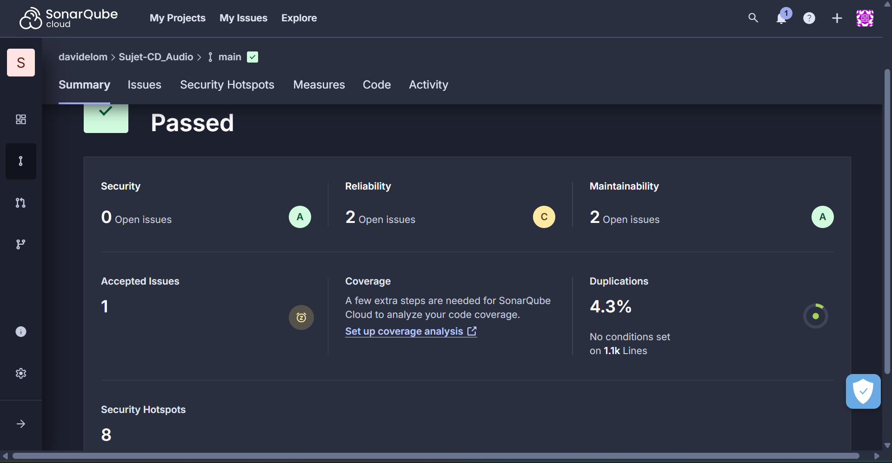

# Retour sur le projet

Dans le cadre de ce projet, je n’ai pas pu installer **Docker** en local. Cela signifie que je n’ai entrepris aucune configuration ou manipulation liée à Docker Compose, aux fichiers Dockerfile, etc. L’ensemble du workflow Docker n’a donc pas été mis en pratique dans mon environnement.

En revanche, voici ce que j’ai pu mettre en place :

1. **Tests côté serveur :**

    - J’ai réalisé des **tests unitaires** sur les _controllers_ Node.js (Express) en utilisant **Jest**. Ces tests visent à valider la logique métier et le comportement isolé de chaque _controller_.
    - J’ai également mis en place des **tests d’intégration** pour vérifier l’interaction entre les routes Express et la base de données PostgreSQL. Cela inclut la validation des requêtes HTTP (GET, POST, DELETE) et la vérification de l’état de la base.

2. **Tests côté client :**

    - J’ai utilisé **Cypress** pour écrire des **tests E2E (end-to-end)**. Ces tests simulent le parcours utilisateur complet : ajout de CD, affichage de la liste, suppression, etc.
    - Toujours avec Cypress, j’ai réalisé des **tests de composants** (Component Testing) pour valider le rendu et le comportement de chaque composant React (AddCD, CDList, CDItem, etc.) de manière isolée.

3. **Analyse SonarQube :**

    - Je n’ai pas pu installer SonarQube en local, faute de configuration appropriée (ou pour d’autres contraintes techniques).
    - Pour maintenir l’analyse de la **qualité de code** et de la **couverture de tests**, j’ai donc opté pour **SonarQube Cloud**, relié à mon dépôt GitHub. Cette solution m’a permis de vérifier les métriques (bugs, vulnérabilités, couverture de tests, etc.) directement via l’interface en ligne.

    

En résumé, malgré l’impossibilité d’utiliser Docker, j’ai pu assurer une bonne partie des tests (unitaires, intégration, E2E, composants) et conserver un suivi de qualité de code via SonarQube Cloud.
